# githupStats

Generates the GitHub stats cards on my profile README.

It pulls commit, PR, issue, contribution and language data from the GitHub API and
renders it into SVG cards. A GitHub Actions job refreshes them every hour and commits
the result, and the README points straight at those files. No server to keep alive, no
endpoint to deploy.

Every card is rendered twice, in a light and a dark theme, so the README can follow the
reader's system preference.

## Cards

| File | What it shows |
| --- | --- |
| `stats.svg` | Commits, PRs, issues, stars, repositories and followers as individual tiles, with a rank ring in the header |
| `recent-langs.svg` | Language split as a donut chart, limited to repositories pushed to in the last 12 months |
| `contributions.svg` | Contributions for the past year, current and longest streak, and the commit/PR/issue mix |
| `activity.svg` | Contribution heatmap for the last 52 weeks |
| `top-langs.svg` | All-time language split, ignoring how recently a repository was touched. Off by default — enable `topLangs` in the config to render it |






Standard cards are 435×235 and the activity card is 886 wide — exactly two cards plus the
gap. A profile README column is narrower than that, so render them at `width="405"` and
`width="822"` to keep two cards on a row instead of stacking.

The cards animate on load: tiles stagger in, donuts sweep clockwise from twelve o'clock,
the mix bar fills from the left and the heatmap sweeps in week by week. It is all
declarative CSS, since GitHub renders SVG stylesheets but never runs scripts, and it sits
behind `prefers-reduced-motion` so the still frame is the default. Set `animations` to
`false` in the config to drop the keyframes entirely.

## How it works

`.github/workflows/stats.yml` runs `scripts/generate.js` hourly. The script queries the
GitHub GraphQL API, writes the SVGs into `generated/light/` and `generated/dark/`, and
the workflow commits them if anything changed.

Lifetime commit counts aren't available through GraphQL — the contributions collection
only covers the trailing year — so that number comes from a separate call to the commit
search API.

If the data can't be fetched the script exits non-zero. The workflow fails, the last
working cards stay in `generated/`, and the README never shows a broken image.

## Adding this to your own profile

**1.** Fork this repository.

**2.** Create a classic personal access token at
[Settings → Developer settings → Tokens (classic)](https://github.com/settings/tokens/new).
The `repo` scope is enough. Pick `No expiration` unless you want to rotate it manually —
when the token expires the cards quietly stop updating.

A PAT is required, not optional: the workflow's built-in `GITHUB_TOKEN` cannot read
user-level GraphQL data and fails with `Resource not accessible by integration`.

**3.** Add the token as a repository secret named `STATS_TOKEN`:

```bash
gh secret set STATS_TOKEN
```

Through the web UI: Settings → Secrets and variables → Actions → New repository secret.

**4.** Set `username` in `config/stats.config.json` to your own login.

**5.** Run the workflow once by hand:

```bash
gh workflow run stats.yml
```

**6.** Add the cards to your profile README. Replace `YOUR-USERNAME` in the snippet
below — `<picture>` makes GitHub serve the dark version to readers using dark mode:

```html
<p align="center">
  <picture>
    <source media="(prefers-color-scheme: dark)" srcset="https://raw.githubusercontent.com/YOUR-USERNAME/githupStats/main/generated/dark/stats.svg" />
    
  </picture>
  <picture>
    <source media="(prefers-color-scheme: dark)" srcset="https://raw.githubusercontent.com/YOUR-USERNAME/githupStats/main/generated/dark/contributions.svg" />
    
  </picture>
</p>
```

Swap in any of the other card filenames the same way.

To run it locally:

```bash
STATS_TOKEN=ghp_xxx npm run generate
```

## Configuration

Everything lives in `config/stats.config.json`. Each card section takes `enabled` and
`title`; set `enabled` to `false` to skip a card entirely.

| Key | Description |
| --- | --- |
| `username` | Whose stats to render |
| `themes` | Output directory → theme name. Defaults to `{ "light": "light", "dark": "dark" }` |
| `animations` | `false` renders the cards without any keyframes |
| `stats.includeAllCommits` | `false` counts only the current year |
| `stats.countPrivate` | Include private contributions |
| `stats.showRank` | Show the rank ring |
| `topLangs.count` | How many languages to list (up to 10 fits) |
| `topLangs.affiliations` | Which repos count: `OWNER`, `ORGANIZATION_MEMBER`, `COLLABORATOR` |
| `topLangs.excludeLangs` | Languages to ignore |
| `topLangs.excludeRepos` | Repositories to ignore |
| `recentLangs.sinceDays` | Size of the recent window, in days |
| `recentLangs.subtitle` | Badge text in the card header |

Available themes: `light`, `dark`, `vue`, `default`, `radical`, `tokyonight`, `dracula`.
Only `light` and `dark` define the tile colours; the rest fall back to a tinted overlay.
`recentLangs` inherits the exclusion and affiliation settings from `topLangs`.

`affiliations` includes organization and collaborator repositories by default. Leave only
`OWNER` and none of your work code will show up in the language cards.

## Notes

- Language percentages are based on **bytes of code**, not commit counts — the same way
  GitHub Linguist works. A large vendored file added years ago can outweigh everything
  you wrote this month, which is what `excludeRepos` and `excludeLangs` are for. The
  `recent-langs` card exists for the same reason: it only counts repositories you have
  actually pushed to lately.
- Forks are excluded from the language breakdown.
- The rank is a weighted score over fixed medians. See `src/rank.js`.
- GitHub disables scheduled workflows on repositories that sit inactive for 60 days.
